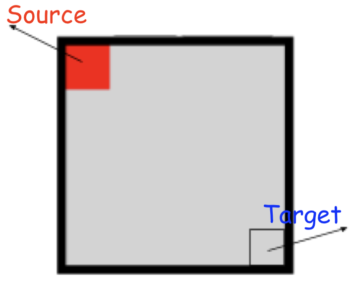
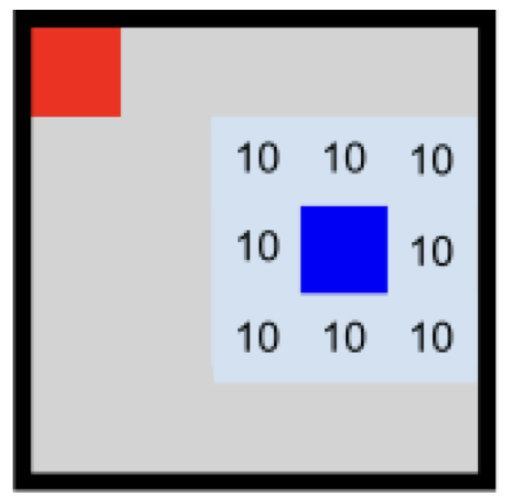
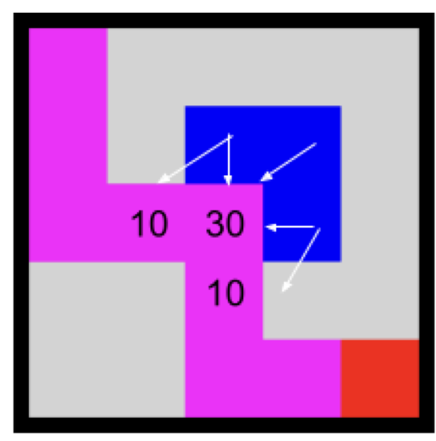
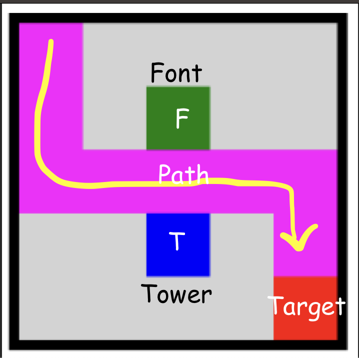
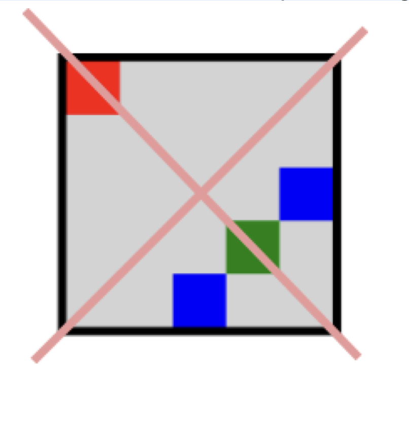
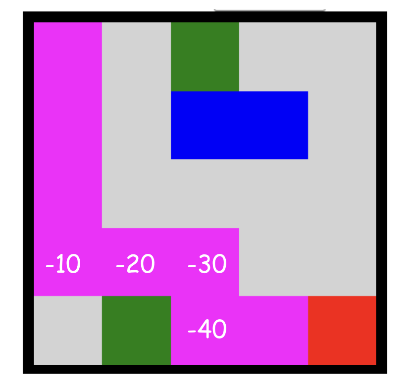
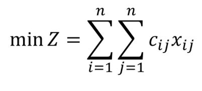
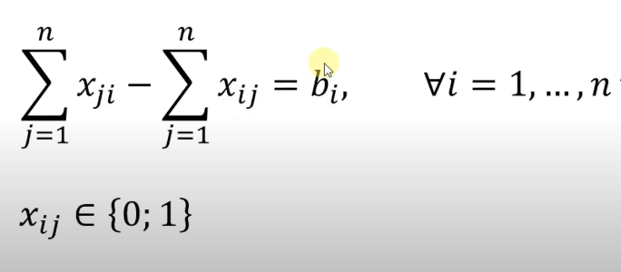

## How to run
Just hit:
```sh
make
make run ARGS=1
```
Where 1 could be 1-8, is the test cases

You could also:

```sh
gcc *.c -Wall -pedantic-errors -o program -lm
./program < test_case/$(ARGS).in
```

To verify if is the correct solution:

```sh
ARGV=1 && diff <(./program < casos_de_teste_02-2/$ARGV.in) casos_de_teste_02-2/($ARGV).out
```

## Problem Description

 - The n x n board, the attacker leaves the top left square at the coordinate (0, 0) and must reach the square (n-1, n-1).

 - The Defender can place as many towers as he wants at any position on the board (exceptions will be explained later) and each tower does 10 damage to each square that is adjacent to the tower. 
 - The tower attacks all of its neighbors, including diagonally.

 - The damage from towers accumulates, i.e. in a square which has 3 towers in adjacent squares, if the attacker passes through it, he will suffer 30 damage. The attacker can also suffer multiple damages from the same tower if he passes by more than one square defended by it. In the following picture the path taken by the attacker is marked in magenta, note that the attacker suffers 50 damage.

 - There are Healing Fountains that are born on the board at the beginning of the game. The Healing Fountains work like the Tower, but they heal the attacker with 10 life per square (you can understand this as a negative damage of -10). In the following picture, the fountain is represented by the green square. Note that the attacker passes without taking damage, because all damage from the turret, is negated by the healing from the Fountain. You cannot pass in a position with a font or a tower.

 - The defender cannot build a tower in the same square as a Fountain but can build adjacent to it. The attacker can only move up, down, left, and right, and cannot go diagonally. The defender cannot completely block the attacker's passage. For example, the configuration below is forbidden.

 - The attacker would like to take as little damage as possible (if possible even negative damage), on the condition that he cannot pass the same square twice.

 - Each vertical can only be visited once to avoid a cycle.
 
 
- You will be given an initial implementation that reads the board and you must implement the requested functions. The initial program reads from the system input the board in the following format, first the size n of the board, and then n lines each with n characters, where 0 (zero) means open field, F means Healing Source, and T means Tower. There is no special marking at the origin and destination of the attacker, but these positions are expected to be free.
 - A solution for job 01 is a path formed by the directions the attacker should move. The directions are given by characters 'N' north, 'S' south, 'O' west, and 'L' east.
 - You will be given a partial code, which reads the board in a two-dimensional array of characters and creates an array with n * n characters, sufficient for any path through the board. You will have to implement the function find_heuristic_path
 - Example Input

```
5
00F00
00TT0
00000
00000
0F000
```

 - Expected output
```
size_path : 8
path : ['S', 'S', 'S', 'E', 'E', 'S', 'E', 'E']
```

Explanation:

Path must have this values:

 - 'S' - South
 - 'N' - North
 - 'E' - East
 - 'W' - West


## Atemptives

### Integer Programming Modeling

Where: 
 - `Xij` is a binary variable that dictates if a path is visited or not in a valid solution
 - `Cij` is the weight of that node
 - `Bi`is a  capacity of a node, a flow constraint of that can be {-1, 0, 1}
   - `-1` is the source (where will be the {0,0} position of the input matrix)
   - `0` the intermediate nodes
   - `1` the target node (will be the {n-1, n-1} position of matrix)

Objective function:


Constraints:


 - For each node, everything that enter a node less then everything that exit the node must be equal the desired flow Bi